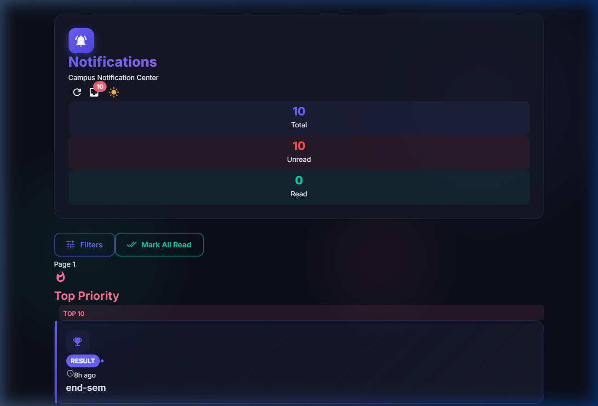
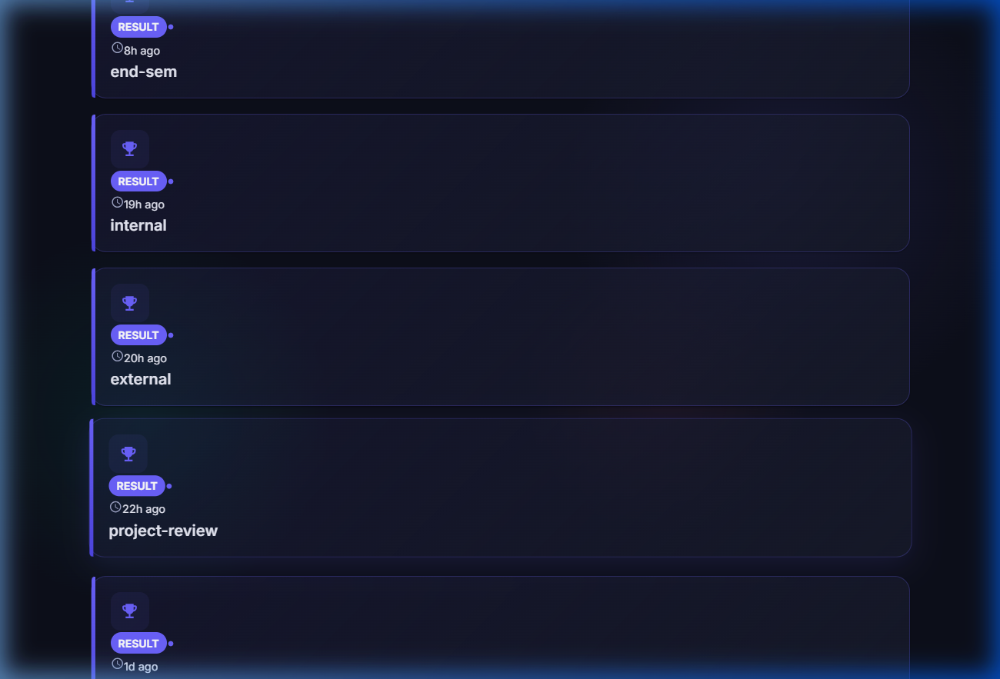
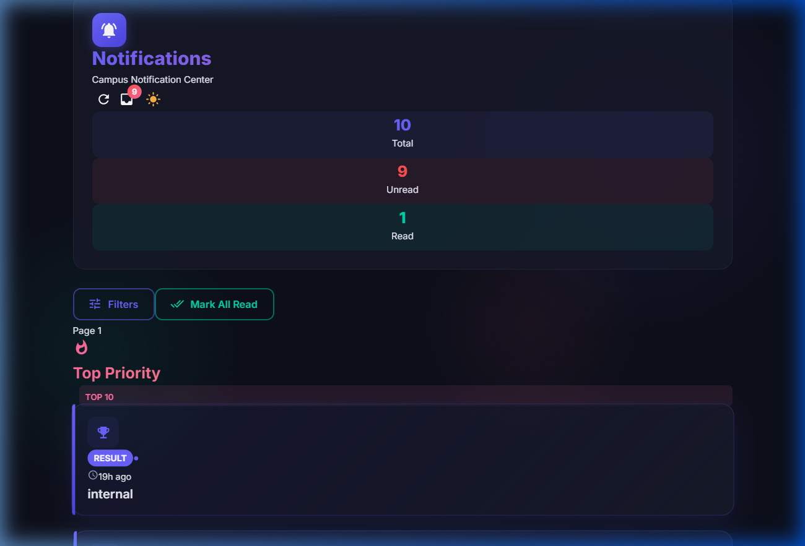
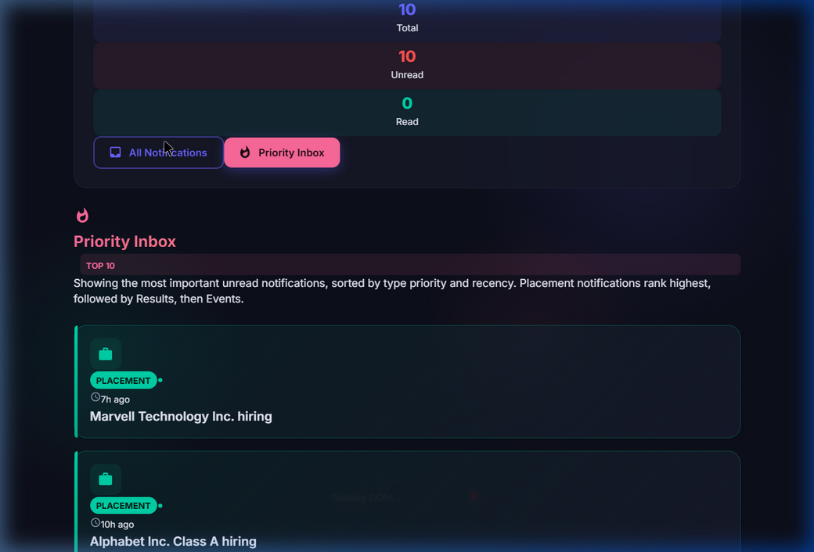
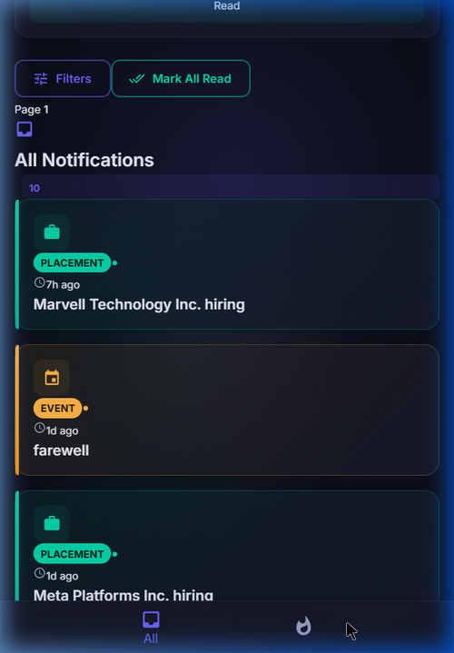
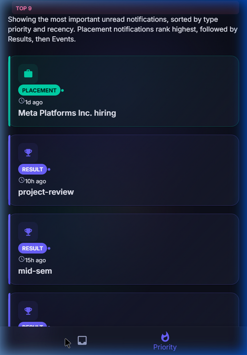

# Stage 1

## Priority Inbox — Notification System Design

### Problem

Users are losing track of important notifications because of the high volume. We need a **Priority Inbox** that always shows the top N most important *unread* notifications first, so critical updates like placements and results never get buried.

### Approach

The priority inbox works by sorting unread notifications using two factors:

1. **Type weight** — each notification type has a fixed weight:
   - Placement = 3 (highest — these are career-critical)
   - Result = 2
   - Event = 1 (lowest)

2. **Recency** — when two notifications have the same type, the newer one ranks higher

The sorting logic lives in `src/utils/priority.js`. It filters out read notifications first, then sorts by weight descending, then by timestamp descending as a tiebreaker, and returns the top N (default 10).

```javascript
// src/utils/priority.js
const weights = {
  Placement: 3,
  Result: 2,
  Event: 1,
};

export function getTopN(notifications, n = 10) {
  return [...notifications]
    .filter(item => !item.read)
    .sort((a, b) => {
      const diff = (weights[b.Type] || 0) - (weights[a.Type] || 0);
      if (diff !== 0) return diff;
      return new Date(b.Timestamp) - new Date(a.Timestamp);
    })
    .slice(0, n);
}
```

### How It Works in the UI

- The app fetches notifications from the API and tracks read/unread state locally
- `getTopN` is called via `useMemo` — it recomputes automatically whenever the notifications array changes (including when a notification is marked as read)
- The "Top Priority" section at the top of the page always shows the 10 most important unread notifications
- Clicking a notification marks it as read, and it drops out of the priority list immediately
- The "All Notifications" section below shows everything regardless of read state

### Handling New Notifications Efficiently

As new notifications keep coming in, here's how the top 10 stays accurate:

1. **On each page load / filter apply** — fresh data is fetched from the API, all marked unread, and `getTopN` recalculates the top 10 from the full set
2. **On mark-as-read** — React's `useMemo` dependency on `notifications` means the top 10 list is recomputed instantly without re-fetching from the server
3. **Why this is efficient** — sorting 10-20 items is essentially O(1) in practice. Even with hundreds of notifications per page, the sort + filter + slice operation takes microseconds. There's no need for a heap or any complex data structure at this scale

If the dataset grew to thousands of in-memory notifications, you could optimize by:
- Using a min-heap of size N to maintain top-N in O(n log N) instead of O(n log n) full sort
- Moving the priority computation to the backend/database with indexed queries
- But for the current scale (paginated, 10 per page), the simple approach is the right one

### Screenshots

**Priority Inbox showing top 10 unread notifications:**



**All Notifications section:**



**After marking a notification as read — it drops from priority list:**



### File Structure

```
src/
├── utils/
│   └── priority.js              # getTopN sorting logic
├── components/
│   └── NotificationList.js      # renders notification cards
├── pages/
│   ├── AllNotifications.js      # all notifications page with filters + pagination
│   └── PriorityInbox.js         # priority inbox page (top 10 unread)
├── App.js                       # shared shell, routing, context provider
├── theme.js                     # MUI theme config
├── services/
│   └── notificationService.js
└── logging_middleware/
    ├── auth.js
    └── logger.js
```

---

# Stage 2

## Frontend Architecture

### Tech Stack

- **React 19** (CRA) — runs on localhost:3000
- **Material UI v9** — used exclusively for all styling and components
- **react-router-dom** — client-side routing between pages

### Page Structure

The app has two distinct pages accessible via navigation:

| Route | Page | What it shows |
|-------|------|---------------|
| `/` | All Notifications | Full notification list with filters, type dropdown, pagination, mark-all-read |
| `/priority` | Priority Inbox | Top 10 unread notifications sorted by weight + recency |

On **desktop**, navigation tabs appear inside the header card ("All Notifications" / "Priority Inbox" buttons).

On **mobile** (< 600px), navigation switches to a fixed bottom bar with "All" and "Priority" tabs, matching native app patterns.

### Shared State via Context

Both pages share the same notification data through React Context (`AppContext`). This means:
- Marking a notification as read on one page is immediately reflected on the other
- No duplicate API calls — data is fetched once and shared
- The unread badge count in the header updates in real time

### Read / Unread Distinction

- All fetched notifications start as `read: false`
- Clicking a card sets `read: true` on that notification
- Read notifications appear with: lower opacity, outlined chip (vs filled), muted colors, a checkmark icon
- Unread notifications show: colored left border strip, filled chip, dot indicator, bold message text

### Responsive Design

The layout adapts to mobile through:
- `useMediaQuery` for breakpoint detection
- Responsive header icon/text sizes via MUI's `sx` breakpoint syntax
- Bottom navigation on mobile (replaces header buttons)
- Extra bottom padding to prevent content from being hidden behind the bottom nav
- Stats bar spacing adjusts (`gap: { xs: 1, sm: 2 }`)

### Error Handling

- `fetchNotifications` catches API errors and returns `[]` (no crash)
- `Log` calls are wrapped in try/catch (logging failures don't break the app)
- Auth errors bubble up but are contained in the init flow
- All async operations use proper error boundaries

### Screenshots

**Desktop — All Notifications page:**


**Desktop — Priority Inbox page:**



**Mobile — All Notifications with bottom nav:**



**Mobile — Priority Inbox:**



### Video Recordings

- `screenshots/desktop_demo.webp` — Desktop walkthrough
- `screenshots/mobile_demo.webp` — Mobile viewport walkthrough
